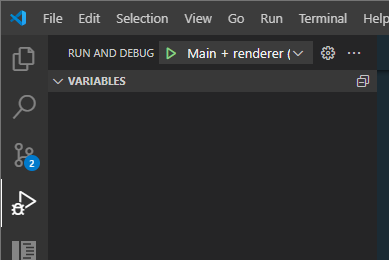

# Getting Started

## Requirements

- [Node version 20.x](https://nodejs.org)

> [!NOTE]
> Developing on [Windows WSL](https://learn.microsoft.com/en-us/windows/wsl/)?
> This project launches an Electron GUI application and therefore may not work on WSL.

## Install

```bash
npm install
```

## Build

```bash
npm run build
```

> [!NOTE]
> Running into build errors? Try running `npm run electron:rebuild` and then `npm run build`

## Developing

This will run the application with hot reloading enabled for client-side code and auto relaunches the applications when changes are made to the backend.

```bash
npm run dev
```

## Debugging

If using [VS Code](https://code.visualstudio.com/) for development, one can debug the application by setting break points and running the **Main + renderer** debug mode.


